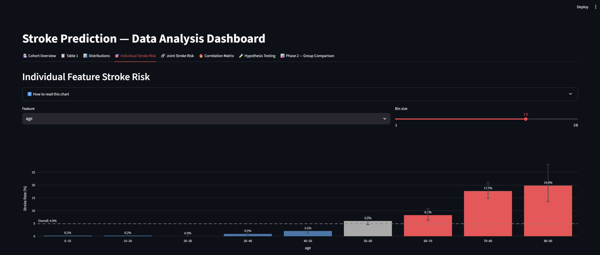
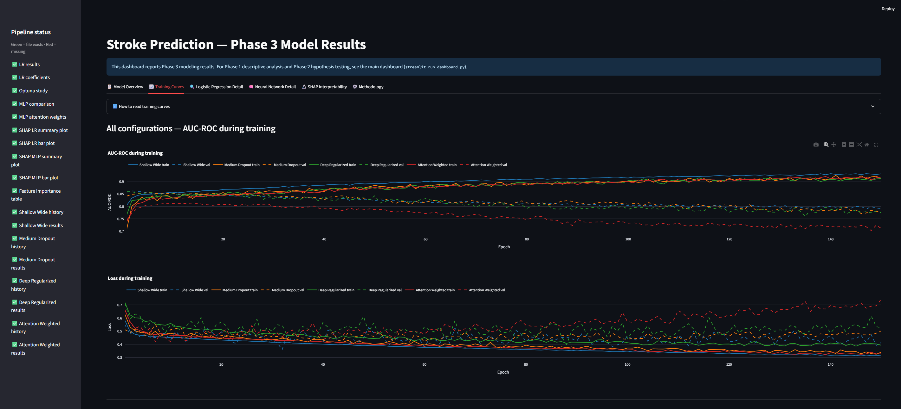

# Stroke-Prediction

This project applies a clinical medical research workflow to the [Stroke Prediction Dataset](https://www.kaggle.com/datasets/fedesoriano/stroke-prediction-dataset) to identify which combination of cardiovascular and lifestyle risk factors can be used to predict strokes, and determine if a model can be used to identify high-risk patients prior to the event.

## Data source

Soriano, F. (2021). *Stroke Prediction Dataset* [Data set]. Kaggle.
https://www.kaggle.com/datasets/fedesoriano/stroke-prediction-dataset

Original data sourced from a McKinsey & Company healthcare analytics competition
via Analytics Vidhya. The dataset contains 5,110 de-identified patient records
with 11 clinical features.

## Setup

```bash
pip install kagglehub[pandas-datasets] python-dotenv scikit-learn pandas numpy scipy streamlit plotly optuna joblib tensorflow shap
```

Create a `.env` file in the project root with your Kaggle credentials:
```
KAGGLE_USERNAME=your_username
KAGGLE_KEY=your_key
```

## Running the Pipeline

```bash
python retrieve_data.py       # Download dataset → data/stroke_data.csv
python feature_engineering.py # Impute missing values → data/stroke_data_clean.csv + data/data_quality_report.txt
python hypothesis_testing.py  # Group comparison analysis → data/phase2_hypothesis_results.csv + data/phase2_interpretation.txt
python train_logistic.py      # Logistic regression baseline → data/lr_model.pkl + data/lr_results.json
python train_mlp.py           # Four MLP configurations → data/mlp_*
python shap_analysis.py       # SHAP values + feature importance comparison → data/shap_* + data/feature_importance_comparison.csv
streamlit run dashboard.py        # Phase 1/2: descriptive analysis + hypothesis testing
streamlit run model_dashboard.py  # Phase 3: model results (separate app)
```

## Data Preprocessing

Missing and unknown values are handled in `feature_engineering.py` using K-Nearest Neighbors (k=5):
- **BMI** — NaN values imputed based on similar patients
- **Smoking status** — `"Unknown"` entries resolved to the most common status among nearest neighbors

## Key Findings — Phase 2

Group comparison tests (Mann-Whitney U and chi-square) were run comparing stroke vs. no-stroke patients across all 10 clinical features.

| Feature | Result | Effect Size |
|---------|--------|-------------|
| age | Significantly higher in stroke patients (median 71.0 vs. 43.0 years, p < 0.001) | Cohen's d = 1.175 (large) |
| avg_glucose_level | Significantly higher in stroke patients (median 105.2 vs. 91.5 mg/dL, p < 0.001) | Cohen's d = 0.618 (medium) |
| heart_disease | Higher odds of stroke (OR = 4.70, 95% CI 3.26–6.69, p < 0.001) | Cramér's V = 0.133 (small) |
| hypertension | Higher odds of stroke (OR = 3.70, 95% CI 2.70–5.02, p < 0.001) | Cramér's V = 0.126 (small) |
| ever_married | Higher odds of stroke (OR = 4.18, 95% CI 2.82–6.42, p < 0.001) | Cramér's V = 0.107 (small) |
| bmi | Significantly higher in stroke patients (median 29.5 vs. 28.1 kg/m², p < 0.001) | Cohen's d = 0.185 (negligible) |
| work_type | Distribution differs by stroke outcome (p < 0.001) | Cramér's V = 0.098 (negligible) |
| smoking_status | Distribution differs by stroke outcome (p < 0.001) | Cramér's V = 0.055 (negligible) |

2 features did not reach statistical significance (p ≥ 0.05): `gender` and `Residence_type`.

All associations are observational; no causal claims are made. See `data/phase2_interpretation.txt` for full manuscript-style interpretation.

## Phase 3 — Predictive Modeling

Feature selection is dynamic: `preprocessing.py` reads `data/phase2_hypothesis_results.csv` at runtime and trains only on features where Phase 2 returned a significant result (`Sig. != 'ns'`). Currently 8 features: `age`, `avg_glucose_level`, `heart_disease`, `hypertension`, `ever_married`, `bmi`, `work_type`, `smoking_status`.

**Class imbalance** (~4.9% stroke prevalence) is handled with balanced class weights (ratio ≈ 1:19.5). SMOTE was not used — it risks generating clinically unrealistic feature combinations, while class weighting achieves the same gradient-level effect without altering the data distribution.

**Logistic regression baseline** (`train_logistic.py`) — ElasticNet regularization, hyperparameters tuned via 100-trial Optuna Bayesian search maximizing 5-fold CV AUC-ROC.

**MLP configurations** (`train_mlp.py`) — four architectures, each testing a distinct hypothesis:

| Config | Architecture | Hypothesis |
|--------|-------------|------------|
| Shallow Wide | [128] | Near-linear separability is sufficient after feature engineering |
| Medium Dropout | [64, 32] | Dropout improves generalization over a shallow network |
| Deep Regularized | [128, 64, 32] | Combined dropout + L2 regularization enables a deeper network |
| Attention Weighted | [64, 32] | Learned per-feature input weighting improves discrimination and interpretability |

### Model Performance Results

At the optimal threshold (weighted Youden's J, 60% sensitivity / 40% specificity):

| Model | AUC-ROC | Sensitivity | Specificity | F1 | Optimal Threshold |
|-------|---------|-------------|-------------|-----|-------------------|
| **Logistic Regression** | **0.841** | **0.840** | 0.648 | 0.194 | 0.420 |
| Shallow Wide | 0.784 | 0.620 | **0.805** | 0.229 | 0.500 |
| Medium Dropout | 0.802 | 0.680 | 0.803 | **0.246** | 0.581 |
| Deep Regularized | 0.792 | 0.640 | 0.793 | 0.226 | 0.540 |
| Attention Weighted | 0.771 | 0.620 | 0.784 | 0.213 | 0.531 |

At the default 0.5 threshold:

| Model | AUC-ROC | Sensitivity | Specificity | F1 |
|-------|---------|-------------|-------------|-----|
| **Logistic Regression** | **0.841** | **0.820** | 0.731 | **0.232** |
| Shallow Wide | 0.784 | 0.620 | **0.805** | 0.229 |
| Medium Dropout | 0.802 | 0.720 | 0.745 | 0.216 |
| Deep Regularized | 0.792 | 0.660 | 0.763 | 0.211 |
| Attention Weighted | 0.771 | 0.620 | 0.758 | 0.196 |

**Key findings.** Logistic regression outperforms all four MLP configurations (AUC-ROC 0.841 vs. 0.771–0.802), suggesting the signal in these 8 features is largely linear after preprocessing. The optimal threshold raises sensitivity substantially for LR (0.82 → 0.84) at the cost of specificity, consistent with the clinical priority of catching missed strokes. Among the MLPs, Medium Dropout achieved the best AUC-ROC (0.802) and F1 (0.246), while the Attention Weighted config underperformed despite its added complexity. SHAP analysis identifies `age` as the dominant predictor (mean normalized importance 1.000), followed distantly by `bmi` (0.197) and `avg_glucose_level` (0.177) — a ranking consistent across LR coefficients, LR SHAP, MLP SHAP, and MLP attention weights.

All models are evaluated at default (0.5) and optimal threshold. The optimal threshold maximizes a weighted Youden's J statistic (60% sensitivity, 40% specificity), reflecting the clinical priority of catching missed strokes while maintaining meaningful specificity.

**SHAP feature importance** (`shap_analysis.py`) — produces beeswarm/bar plots for LR and the best MLP, plus `data/feature_importance_comparison.csv`: a normalized [0, 1] ranking across LR coefficients, LR SHAP, MLP SHAP, and MLP attention weights.

### Running the model dashboard

```bash
streamlit run model_dashboard.py
```

Runs independently from `dashboard.py`. A sidebar shows ✅/❌ status for every expected pipeline output and displays the command needed to generate any missing file.

## Project Architecture

```
Stroke-Prediction/
├── retrieve_data.py         # Phase 1 — downloads dataset from Kaggle
├── feature_engineering.py  # Phase 1 — KNN imputation, outlier flags
├── analysis_utils.py        # Phase 2 — statistical analysis library (CI, z-test, Mann-Whitney, chi-square)
├── hypothesis_testing.py    # Phase 2 — group comparison analysis, writes results CSV
├── preprocessing.py         # Phase 3 — shared feature engineering for all model training scripts
├── train_logistic.py        # Phase 3 — ElasticNet logistic regression with Optuna tuning
├── train_mlp.py             # Phase 3 — four MLP configurations (Keras)
├── shap_analysis.py         # Phase 3 — SHAP values and feature importance comparison
├── dashboard.py             # Dashboard — Phase 1/2 interactive analysis (8 tabs)
└── model_dashboard.py       # Dashboard — Phase 3 model results (6 tabs)
```

All pipeline outputs go to `data/` (gitignored). Scripts must be run in the order shown in [Running the Pipeline](#running-the-pipeline).

## Interactive Dashboards

Two separate Streamlit apps cover different phases of the project.

### Phase 1/2 dashboard (`dashboard.py`)

The Streamlit dashboard provides eight analysis tabs:

- **Cohort Overview** — Summary metrics, data quality report, and IQR outlier flag counts
- **Table 1** — Clinical manuscript-style Table 1 stratified by stroke outcome; continuous variables as Mean (SD) with Mann-Whitney U p-values, categorical variables as n (%) with chi-square p-values; CSV download included
- **Distributions** — Categorical features as stacked percentage bars (stroke share per category); numeric features as overlapping count histogram plus a box plot split by outcome
- **Individual Stroke Risk** — Stroke rate per feature value or bin, with 95% Agresti-Coull confidence intervals and hypothesis test color coding (red = significantly higher risk, blue = significantly lower, gray = not significant)
- **Joint Stroke Risk** — Conditional stroke probability for a custom patient profile, shown on a gauge vs. the population baseline
- **Correlation Matrix** — Pearson correlation heatmap across all features
- **Hypothesis Testing** — Two-sided z-tests of each feature value's stroke rate against the overall population rate (p₀), with z-statistic bar chart and per-feature forest plots
- **Phase 2 — Group Comparison** — Mann-Whitney U and chi-square tests comparing stroke vs. no-stroke groups directly, with odds ratios, effect sizes (Cohen's d / Cramér's V), a styled results table, per-feature detail charts, and an OR forest plot covering both binary and dummy-coded categorical variables

Each tab includes an in-app help section explaining how to interpret the results.



### Phase 3 dashboard (`model_dashboard.py`)

Reports all modeling results transparently, showing what happened under the hood:

- **Model Overview** — all five models (LR + 4 MLPs) side by side at both default and optimal thresholds; best-model cards; plain-English threshold explanation
- **Training Curves** — all four MLP configs on the same axes (AUC-ROC and loss); per-config detailed view with early stopping epoch marked
- **Logistic Regression Detail** — Optuna optimization history, hyperparameter search space scatter, coefficient and odds-ratio plots, confusion matrices at both thresholds
- **Neural Network Detail** — per-config architecture table, training subplots, confusion matrices, attention weight chart (Config D)
- **SHAP Interpretability** — beeswarm and bar plots for LR and best MLP; feature importance comparison table with gradient styling; per-feature cross-method rank cards
- **Methodology** — written rationale for every modeling decision; data flow diagram; limitations

A sidebar shows file status (✅/❌) for every expected output file with the command needed to generate it.


